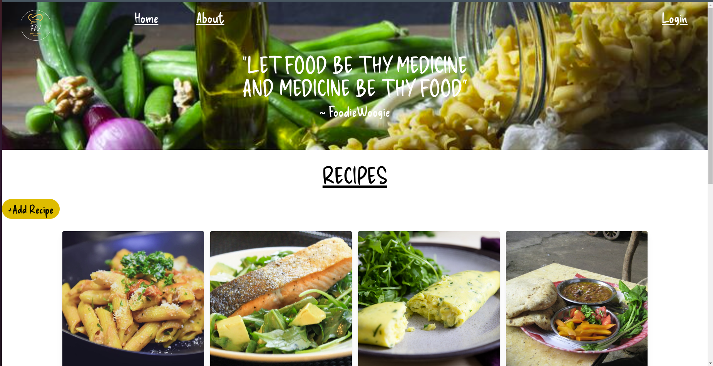
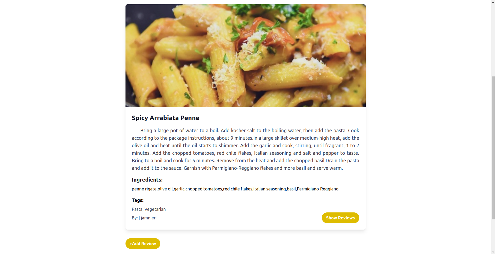

FOODIE WOOGIE
==========================

## DESCRIPTION
Foodie Woogie is a mini web application that allows users to browse, create, update and delete recipes from a food library.

## REQUIREMENTS
### Prerequisites
* node v14.17.4 and above
* npm 6.14.14 and above
* Vue 2.6.11
* Then install the various packages from package.json `npm install`
* Create environment variables

#### PROJECT DELIVERABLES
* As a user one should be able to view a landing page that displays the recipe library with cards of the different recipes available in the website.
* As a user you can click on the view button on the card to open up the individual recipe and see more details such as the ingredients, how to make it, the reviews associated with it along with it's tags.
* If a user wants to add, edit or delete any of the recipes, then they are routed to the login page to login or sign up.
* The same applies to adding a Review or a Tag to a Recipe.
* In addition, only the owner of a Recipe or a Review can edit it or delete it. 

### PROJECT-SETUP-INSTRUCTIONS
1. [Clone the repo to your local machine](https://github.com/jamnjeri/phase-4-final-project-frontend)
2. Install required dependencies for by running `npm i`.
3. Legacy dependencies may be installed by running `npm i -f`
4. Run the application using  `npm start` to start the development server.

### TECHNOLOGIES-Used
- HTML - Used as a template to hold the React components of the app via the root div.  
- CSS -used to style the User Interface.  
- JS - Java Script is used to make the website interactive.  
- REACT.js - Front-end Library.  
- ​Tailwind - Styling purposes.  
- Git- For Version control.

## Status:
    maintained, and is currently in development

## Version:
    v0.1.0
    
## Usage

## License

Copyright © 2023 Mathu Jamila

## Website Sample Images

